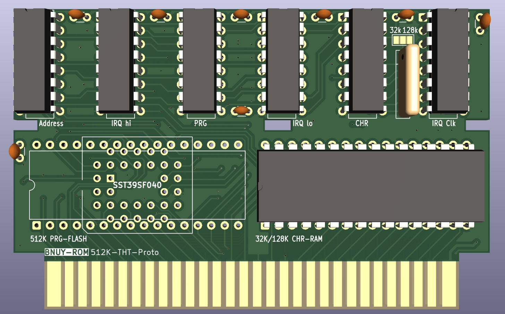

# BNUY-ROM

**Everything in this repo is a WIP, this is not a 100% final design**

An extension of sorts of the BNROM mapper:

* 256, 512, 1024 or 2048 KiB of rewritabble PRG-FLASH (29F Based)
* 32KiB or 128KiB of CHR-RAM with 4x2KiB banked windows
* Four-Screen Mirroring
* (optional) PPU Scanline IRQ
* (optional) Audio Expansion via a SAM2695 soundchip
* (optional) 32KiB of PRG-RAM

## Why?

Bnuy-Rom was developed for my personal homebrew projects, with the goal of being a mapper with a similar level of capabilities to ASIC mappers like the MMC3, while only using generic 74x logic chips. Many of its features are left optional for cost reasons, for instance, the game I'm currently developing for this mapper will likely not make use of PRG-RAM or the SAM2695 sound expansion.

This repo includes a 60-pin famicom board fitted for MMC cartridge shells. It has currently not been fully tested.





# Banks
* CPU $6000-$7FFF: 8KiB switchable PRG-RAM
* CPU $8000-$FFFF: 32 KiB switchable PRG-FLASH
* PPU $0000-$07FF: 2 KiB switchable CHR-RAM Bank
* PPU $0800-$0FFF: 2 KiB switchable CHR-RAM Bank
* PPU $1000-$17FF: 2 KiB switchable CHR-RAM Bank
* PPU $1800-$1FFF: 2 KiB switchable CHR-RAM Bank

# Registers

## PRG-FLASH/CTRL Register ($8000-$9FFF, write)

This register controls both banking of PRG Memory, the IRQ Generator and SAM soundchip.

```
D~7654 3210
  ---------
  ISbb BBBB
  |||| ++++--- PRG-Flash Bank
  ||++-------- shared PRG-Flash Bank and PRG-RAM bank
  |+---------- SAM2695 /CS
  +----------- Freeze IRQ Scanline Counter
```

Note the shared banking bits for PRG-Flash and PRG-Ram for cases where more than 512K of PRG-Flash are used. 

## SAM2695 Registers ($A000-$BFFF, write)

If present, this area will write to the SAM2695 soundchip, note that the SAM's Chip-Select is controlled by the respective bit in the PRG-FLASH/CTRL Register.

```
$A000 (even): Data
$A001 (odd) : Control

D~7654 3210
  ---------
  DDDD DDD
  ++++-++++- 8-bit Data
```
## IRQ Counter Load ($C000-$DFFF, write)
  
If present, this register will load a value into a scanline counter which decrements once per active scanline, the counter will continuously trigger an IRQ whenever its value is 0.
There is no reload latch, so this register must be manually reloaded by software after each use.

To acknowledge an IRQ it should either be set to a value different from zero, or disable by clearing I bit in PRG-BANK to 0, which will lock the counter at 255.

```
D~7654 3210
  ---------
  IIII IIII
  ++++-++++- 8-bit scanline counter value
```

The Counter is triggered by 4 successive reads with PPUA13=1, which occurs once per active scanline, on ppu cycle 4, this is similar to MMC5's scanline counter. Unlike the MMC3, this allows sprites to freely use either pattern table, including both while in 8x16 mode. 

## CHR-RAM Banking ($E000-$FFFF, write)

If present, these registers select one of 16 2KiB CHR-RAM banks, to use for each of the 4 PPU pattern table windows.

In 32KiB mode, Banks 14 and 15 are shared with the 4 nametables, and should be avoided unless special care is taken. This leaves 14 banks that can be freely distributed across the 4 windows.  

In 128KiB mode, each window now has a unique set of 16 banks, however the first 2 windows both share banks 15 with the nametables.

```
$E000: CHR-RAM Bank 0 ($0000-$07FF)
$E001: CHR-RAM Bank 1 ($0800-$0FFF)
$E002: CHR-RAM Bank 2 ($1000-$17FF)
$E003: CHR-RAM Bank 3 ($1800-$1FFF)

D~7654 3210
  ---------
  .... BBBB
       ++++- CHR Bank Select
```
