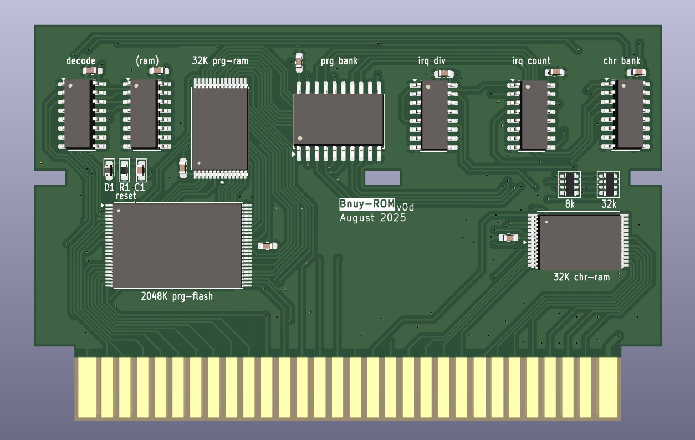
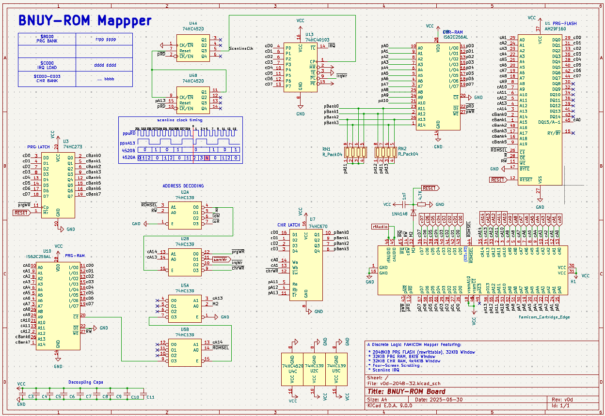

# BNUY-ROM

BNUY-ROM is a discrete logic mapper for the famicom/nes I designed for my homebrew projects, it aims to have a similar level of capabilities to common ASIC mappers, while keeping a low chip count. It is similar to BNROM, hence the name.

Its capabilities are:

* Rewritable PRG-FLASH, 32K Window:
* * **39SFxx** - Up to 512 KiB
* * **29Fxxx** - Up to 2048KiB
* 32KiB PRG-RAM, 8K Window
* 8KiB, 32KiB or 128KiB of CHR-RAM, 4*2K Windows
* Fixed 4-Screen Nametable Arrangement
* Scanline IRQ, with MMC5-like timing

As an in-development mapper, there is currently no iNES number attributed, nor mainstream emulator support.

Render/schematic for the prototype smd/tht versions:





# Banks

* CPU $6000-$7FFF: 8KiB switchable PRG-RAM
* CPU $8000-$FFFF: 32 KiB switchable PRG-FLASH
* PPU $0000-$07FF: 2 KiB switchable CHR-RAM Bank
* PPU $0800-$0FFF: 2 KiB switchable CHR-RAM Bank
* PPU $1000-$17FF: 2 KiB switchable CHR-RAM Bank
* PPU $1800-$1FFF: 2 KiB switchable CHR-RAM Bank

# Registers

## PRG Banking ($8000-$9FFF, write)

This register controls the banking of PRG Flash and Ram.

```
A~100x xxxx xxxx xxxx ($8000)
D~7654 3210
  ---------
  RRPP PPPP
  ||++-++++--- PRG-Flash Bank
  ++-----------PRG-Ram Bank
```

## unused ($A000-$BFFF, write)

In previous iterations of the design, this area was used for a SAM2695 soundchip. It is now unused and avaliable for potential mapper additions.

## IRQ Counter Load ($C000-$DFFF, write)

This register will load a value into a scanline counter, which decrements once per active scanline at ppu cycle 4. The counter will continuously trigger an IRQ whenever its value is 0.

There is no mechanism to stop the counter, and it will underflow to 255 if an interrupt is ignored for 1 scanline. To stop the generator from firing, a value of 255 should be written every nmi.

```
A~110x xxxx xxxx xxxx ($C000)
D~7654 3210
  ---------
  IIII IIII
  ++++-++++- 8-bit scanline counter value
```

### Details

The 8-bit down counter is clocked by bit 2 of a prescaler counter, which increments on PPU reads with A13=1 and is cleared to zero on reads with A13=0. Normally one clock signal is generated by the prescaler per active scanline, but manual reads from PPU_DATA during VBlank will destabilize it. This can be overcome by reading once from A13=0 and twice from A13=1 after reading PPU_DATA, followed by reloading the 8-bit counter.

Overall the mechanism is similar to MMC5's scanline counter, but using relative values like the MMC3. Unlike the MMC3, this counter allows sprites to freely use either pattern table, including both while in 8x16 mode.

It uses a x4520 to detect scanlines, and either a x40103 or two x191/x193s to hold the counter value.

## CHR Banking ($E000-$FFFF, write)

If present, these registers select one of 16 2KiB CHR-RAM banks, to use for each of the 4 PPU pattern table windows.

In **8k/linear mode**, the banking register is ommited. 16KiB of RAM are mapped to the PPU Address space, including 3840 bytes of "bonus ram" above the nametables, which the CPU may use to store values.

In **32K/shared mode**, Banks 0 and 15 are shared with the 4 nametables, and should be avoided unless special care is taken. This leaves 14 banks that can be freely distributed across the 4 windows. 

In **128K/independent mode**, the register is still 4 bits wide, but now each window has their own unique set of 16 banks (by connecting the top 2 address lines of memory to ppu A11/A12), this effectively quadruples the amount of chr-ram without adding a second register chip to the board. The first 2 windows share banks 15 with the nametables

```
A~111x xxxx xxxx xx00 ($E000)
	CHR Window 0
A~111x xxxx xxxx xx01 ($E001)
	CHR Window 1
A~111x xxxx xxxx xx10 ($E002)
	CHR Window 2
A~111x xxxx xxxx xx11 ($E003)
	CHR Window 3

D~7654 3210
  ---------
  .... BBBB
       ++++- CHR Bank Select
```

This uses a single x670 4x4 register. A second register could be added to the design for an oversize variant of 512KiB (shared) or 2048KiB (independent). A design with CHR-ROM could be used instead, at the cost of losing 4-screen nametable arrangement.
